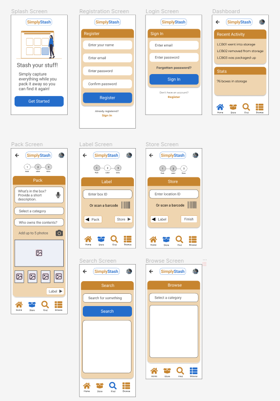

# SimplyStash Storage Management App

## What this project is for

The point of this project is for me to learn the basics of React Native.

Since I'm happy with React and I've written a PWA using it, it makes sense to try this and see what kind of experience PWA users are missing.

## What the app is for

In my household stuff is always getting packed away to go into storage somewhere, and now and then we need to go and find those things again. No-one else seems equipped or willing to do this so I do it.

I pack things into cardboard boxes so they don’t get damaged. Then I put them into storage. Finding the box again is the problem.

So I give every box a unique ID, which I call a box ID, and I write it on the outside of the box.

Each storage location also has a unique ID.

Keeping a record is just a matter of recording the box ID, what went into it, and where that box is ie: the ID of the storage location.
 
At the moment I use a spreadsheet for this purpose.

That's OK but it would be nice to have a photo of the box contents and to be able to use my mobile phone to record the info instead of trying to remember it and coming back to a web interface.

That's what the app is technically for, though it's more of an exercise in learning React Native than anything else.

## Design

A subgoal was to get better at Figma so I've been using that to design the app.

### Wireframes


### Mockups
 


## Running

```npx expo```

On your phone, open the Expo Go app.

Select Scan QR code and scan the one shown on screen.

## Status

Project is at a very early stage ...


